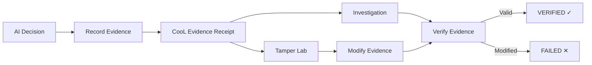
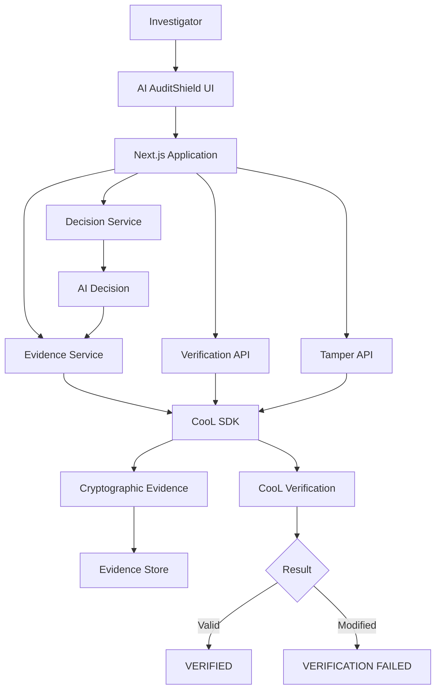

🛡️ AI AuditShield
AI Incident Investigation & Evidence Verification Platform
> **Investigate AI decisions. Verify the evidence. Detect tampering.**
🌐 Live Demo
🐙 GitHub Repository
🎬 Watch the 2-Minute Demo
---
🚨 What is AI AuditShield?
AI AuditShield is a platform for investigating AI-generated decisions and verifying the integrity of the evidence associated with those decisions.
When an important AI decision is questioned, normal application logs may tell us what the system recorded, but they do not necessarily provide cryptographically verifiable evidence that the record has not been changed.
AI AuditShield uses the CooL SDK to create cryptographically verifiable evidence around AI events and provides an investigation workflow for inspecting and verifying that evidence.
---
🔄 How It Works

In simple terms
AI makes a decision → AuditShield records evidence → CooL creates cryptographic evidence → an investigator verifies it → if the evidence is modified, verification can fail.
---
🚨 The Problem
AI systems are increasingly being used to make important decisions such as:
Loan approvals
Fraud detection
Risk assessment
Security decisions
Enterprise AI workflows
When one of these decisions is questioned, an organization needs to investigate what happened.
A normal application log might say:
```text
Case A-4821
Decision: APPROVED
```
That statement alone cannot prove the record hasn't been altered after the fact.
---
💡 Our Solution
AI AuditShield turns AI event evidence into an investigation workflow.
An investigator can:
Open an AI decision case.
Inspect the decision context.
View its CooL evidence receipt.
Verify the evidence.
Simulate evidence-tampering attacks.
Verify the modified evidence again.
Investigate the resulting verification failure.
The core workflow is:
Investigate → Verify → Detect Tampering
---
🔐 How CooL Is Used
CooL is the cryptographic foundation of AI AuditShield.
When an important AI event occurs, AuditShield uses the CooL SDK to create evidence associated with that event.
The resulting evidence can later be passed through CooL's verification process.
Record
AI AuditShield records an AI execution event using the CooL SDK.
Example:
```text
Case:       A-4821
Model:      acme/credit-scorer
Version:    2026.06.0
Policy:     lending-policy-v4
Decision:   APPROVED
```
---
⭐ Why CooL Matters
CooL is not an additional feature added to the application just to provide SDK usage.
It provides the core cryptographic evidence and verification capability behind AuditShield.
Without CooL, the application could provide an investigation interface around normal application logs.
With CooL, the application can work with cryptographically verifiable evidence associated with AI events.
This is what allows AuditShield to demonstrate that modifying the evidence can cause the verification process to fail.
---
🏗️ Architecture

---
🖥️ Product Workflow
1. Dashboard
Provides the main entry point into the investigation platform.
2. Investigation
Allows an investigator to inspect a specific AI decision and its execution context.
3. Evidence Receipt
Displays the evidence associated with the AI event, including cryptographic information such as the evidence digest and signature details.
4. Verification Center
Runs the evidence through CooL verification and displays the verification result.
5. Tamper Lab
Allows users to simulate evidence-tampering attacks and observe how verification responds.
6. Guided Demo
Provides a short guided walkthrough of the complete investigation and verification workflow.
---
💻 CooL Integration
The project uses the CooL SDK directly.
```typescript
import { CooL, verifyEvidence } from "cool-nwc";

const cool = new CooL({
  applicationId: "ai-auditshield"
});

const result = await cool.record({
  type: "model.execution",
  metadata: {
    // AI execution metadata
  },
  payloads: {
    input: JSON.stringify(input),
    output: JSON.stringify(output)
  }
});

const verdict = verifyEvidence(evidence);
```
---
🛠️ Tech Stack
Layer	Technology
Frontend	Next.js / React
Language	TypeScript
Styling	Tailwind CSS
Backend	Next.js API Routes
Cryptographic Evidence	CooL SDK
Verification	CooL `verifyEvidence`
Testing	Automated tests
Deployment	Vercel
Version Control	GitHub
---
🚀 Run Locally
Prerequisites
Node.js 20+
npm
Git
Clone
```bash
git clone https://github.com/k-anushka14/AI-AuditShield.git
cd AI-AuditShield
```
Install dependencies
```bash
npm install
```
Start the development server
```bash
npm run dev
```
Open: http://localhost:3000
Run tests
```bash
npm test
```
Production build
```bash
npm run build
```
---
🧠 Technical Decisions
Real CooL Verification
The application uses the actual CooL verification functionality rather than hard-coded verification results.
Preserving Original Evidence
Tamper operations work on a copy of the original evidence so that the original receipt remains available for comparison and verification.
Sensitive Data
Sensitive payload values are not intended to be stored as plaintext inside the CooL receipt. CooL uses cryptographic commitments for sensitive values.
Clear Verification Failures
Verification failures are displayed to the investigator rather than being hidden behind a generic success state.
---
⚠️ Limitations
This project is a functional prototype designed to demonstrate the AI evidence investigation concept and CooL integration.
Ephemeral Storage
The current demo uses application-level temporary/in-memory storage rather than production-grade persistent storage. A production deployment would require durable storage.
Simulated TDX
The current deployment does not run inside a real Intel TDX confidential computing environment. Attestation/enclave status is therefore presented as simulated where applicable.
AI Correctness
AI AuditShield does not determine whether an AI decision is correct, fair, safe, or unbiased. It focuses on the integrity and verification of recorded evidence.
Compliance
The project does not claim regulatory compliance or legal admissibility of its evidence.
---
🔮 Future Scope
A production deployment could add:
Persistent PostgreSQL storage
Authentication and role-based access control
Organization/workspace support
Durable evidence storage
Evidence export packages
Client-side/offline verification
Advanced investigation timelines
Audit reports
Security monitoring
Rate limiting
Production key management
Real TEE/TDX deployment
CI/CD security checks
---
🏆 Built For
Reverse Hackathon — Round 2: Build & Ship
Built using the CooL SDK by Northwind Cipher.
---
📜 License
MIT License